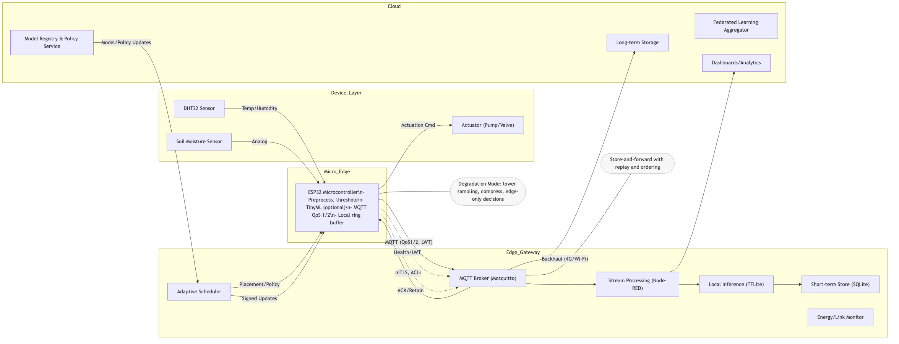
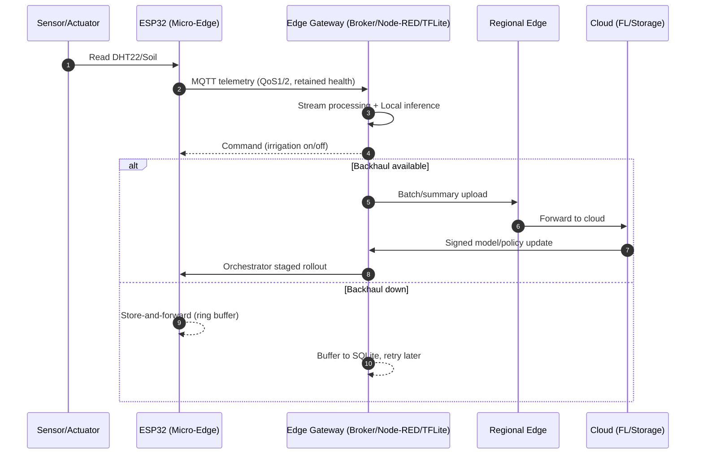

# Assignment 2 – RAECA Deliverables

This folder contains the deliverables for Assignment 2: a Resilient Adaptive Edge-Cloud Framework (RAECA) design, a Wokwi simulation project, and a 1‑page summary PDF.

## Contents

- `raeca-architecture.mmd` – Mermaid diagram describing the full architecture and data/control flows.
 - `raeca-architecture.mmd` – Mermaid diagram describing the full architecture and data/control flows.
 - `raeca-sequence.mmd` – Mermaid sequence diagram showing end-to-end interactions.
- `wokwi/diagram.json` – Wokwi wiring for ESP32 + DHT22 + soil moisture sensor.
- `wokwi/esp32_raeca.ino` – ESP32 firmware (Arduino) publishing telemetry and controlling irrigation.
- `RAECA_Summary.pdf` – One‑page summary (generated).

## How to view the diagram

 - Use a Mermaid preview (VS Code extension or Mermaid Live Editor) and open `raeca-architecture.mmd`.
 - For the sequence view, open `raeca-sequence.mmd` in the same way.
 - Or view the exported image below.

## How to run the Wokwi simulation

1. Open https://wokwi.com/ and choose "New Project" → "ESP32".
2. Replace the default files with:
   - Upload `wokwi/diagram.json` as `diagram.json`.
   - Upload `wokwi/esp32_raeca.ino` as `sketch.ino`.
3. Install required Arduino libraries (in Wokwi, use the Libraries panel):
   - "PubSubClient" (by Nick O'Leary)
   - "DHT sensor library" (by Adafruit) and its dependency "Adafruit Unified Sensor"
4. Update Wi‑Fi credentials in `sketch.ino` (`WIFI_SSID`, `WIFI_PASS`). For Wokwi, use SSID `Wokwi-GUEST` and empty password `""`.
5. Click the green ▶ Run button.
6. Observe telemetry over MQTT (default broker: `broker.hivemq.com`, topic: `raeca/agri/field1/telemetry`).

Notes:
- Pin mapping: DHT22 DATA→GPIO15, Soil AO→GPIO34, both sensors to 3V3/GND.
- The code publishes health/telemetry and toggles irrigation with hysteresis based on soil moisture.
- You can publish commands to `raeca/agri/field1/cmd` with payload `irrigation/on` or `irrigation/off`.

### Troubleshooting

- Error: `fatal error: PubSubClient.h: No such file or directory`
  - Fix: install the "PubSubClient" library (Wokwi Libraries panel; Arduino IDE: Tools → Manage Libraries → search "PubSubClient" → Install; Arduino CLI: `arduino-cli lib install PubSubClient`).
- Error: `fatal error: DHT.h: No such file or directory`
  - Fix: install "DHT sensor library" and "Adafruit Unified Sensor" (Arduino CLI: `arduino-cli lib install "DHT sensor library" "Adafruit Unified Sensor"`).

## Summary PDF

- `RAECA_Summary.pdf` provides a concise, submission‑ready 1‑page overview:
  - Problem, objectives, architecture, flow, resilience/efficiency mechanisms, outcomes.

---

# RAECA Architecture (Detailed)

This section provides the detailed architecture, end‑to‑end flow, and the mechanisms that make RAECA resilient, low‑latency, and continuously available in rural/remote environments with intermittent power and connectivity.

## 1) Framework Design: Layers and Components

RAECA spans a compute continuum: device → micro‑edge → edge gateway → regional edge → cloud. Each layer is designed to operate independently in degraded modes and to synchronize opportunistically when links return.

- Device Layer
  - Sensors/Actuators: DHT22 (temp/humidity), soil moisture probe, irrigation pump/valve relay.
  - Responsibilities: sample, debounce, minimal preprocessing, safe actuation defaults.

- Micro‑Edge (ESP32 class)
  - Functions: light preprocessing, thresholding, TinyML (optional), MQTT QoS1/2 with LWT, local ring buffer for store‑and‑forward.
  - Health/Trust: periodic health beacons, retained online/offline state, topic‑level ACLs.

- Edge Gateway (Raspberry Pi / low‑power NUC)
  - MQTT broker (e.g., Mosquitto) with persistent sessions and retained topics.
  - Stream processing (Node‑RED) for rules, filtering, enrichment, and routing.
  - Local inference (TensorFlow Lite) for latency‑critical decisions.
  - Short‑term storage (SQLite or LiteFS) for offline buffering and replay.
  - Energy/Link monitor watching battery/solar inflow, RSSI, latency, jitter, packet loss.
  - Adaptive scheduler that prioritizes tasks by utility, energy cost, and link quality.

- Regional Edge (micro‑datacenter, community hub)
  - Aggregation of sites, heavier inference, multi‑site coordination, optional FL aggregation.
  - Regional cache and analytics to reduce cloud dependency.

- Cloud
  - Federated learning coordinator with secure aggregation.
  - Long‑term storage and analytics dashboards.
  - Model registry and policy service for rollout and governance.

The Mermaid source for the diagram is in `raeca-architecture.mmd`; a rendered image is embedded above.

## 2) End‑to‑End Data and Control Flow

High‑level sequence under normal conditions:

1. Sensing at device: DHT22 and soil probe sample periodically; ESP32 applies light preprocessing and hysteresis control for irrigation.
2. Publish to edge: ESP32 publishes telemetry over MQTT (QoS1/2, retained health) to the local gateway broker; commands are subscribed on a separate `.../cmd` topic.
3. Stream processing: Node‑RED filters, enriches, and routes telemetry to local inference, short‑term store, dashboards, and (when available) upstream links.
4. Local/Regional inference: TFLite models execute on edge gateway (or regional edge) to provide immediate decisions; results are fed back as commands.
5. Opportunistic backhaul: Data batches, summaries, and model deltas are forwarded to regional/cloud endpoints when the backhaul (Wi‑Fi/4G) is available.
6. Policy/model updates: The model registry/policy service issues signed updates which the adaptive orchestrator validates and rolls out safely.

Disruption path (intermittent power/network):

- On link loss, devices and gateway switch to degraded mode: lower sampling rates, compress payloads, and perform local‑only decisions; telemetry is spooled in ring buffers/SQLite with ordering and retries; retained health topics advertise offline state.
- On power dips, nodes enter duty‑cycle mode guided by the energy monitor; the scheduler prioritizes essential tasks (safety, actuation, health beacons) over non‑critical ones (batch uploads).

Optional sequence diagram (conceptual):

## 3) Functionality: How RAECA Achieves Resilience, Efficiency, and Continuity

- Fault tolerance
  - Store‑and‑forward at multiple tiers: ESP32 ring buffer, gateway SQLite with replay and ordering.
  - Retained health (LWT) topics to signal online/offline state and trigger safe fallbacks.
  - Stateless stream rules and idempotent consumers to tolerate retries and duplicates.

- Energy efficiency
  - Duty‑cycling based on solar/battery budget (energy monitor signals scheduler).
  - Dynamic sampling rates; compress/aggregate at the edge to reduce radio‑on time.
  - Place compute “as low as possible, as high as necessary” to minimize transmission energy.

- Connectivity resilience
  - MQTT QoS1/2 with persistent sessions; retained state for latest values.
  - Opportunistic backhaul (Wi‑Fi/4G); optional DTN/bundling for extremely sparse links.
  - Priority queues (health, safety, commands > telemetry > bulk uploads).

- Adaptive orchestration
  - Inputs: energy budget, link quality, task utility, deadlines, model drift.
  - Actions: reschedule tasks, change placements (device/edge/regional), throttle sampling, defer uploads, stage rollouts.
  - Safety: blue/green model rollout with staged canaries and automatic rollback on KPIs.

- Federated learning (FL)
  - Local training on the gateway using buffered data; periodic model delta uploads.
  - Secure aggregation in the cloud/regional edge; new global models signed and versioned.
  - Drift detection to trigger targeted fine‑tuning in specific regions.

- Trust‑aware communication and governance
  - mTLS for broker connections; topic‑level ACLs and per‑device credentials.
  - Signed model/policy bundles with verification prior to activation.
  - Tamper‑evident logs and minimal‑privilege principles across components.

- Observability and self‑healing
  - Health beacons, SLOs per flow (latency, freshness), and watchdogs.
  - Auto‑restart of failed flows, bounded retries with backoff, and circuit breakers.

### Scheduling and Optimization (sketch)

RAECA’s adaptive scheduler optimizes a multi‑objective score: maximize task utility and model freshness, minimize energy and bandwidth cost, and respect deadlines and trust policies. A simple weighted utility for task i on node n:

U(i,n) = w1·(benefit/latency) − w2·(energy_cost) − w3·(bw_cost) + w4·(reliability) + w5·(trust_score)

Subject to: energy_budget, CPU/RAM limits, link availability, and policy constraints. Placement and throttling are re‑evaluated whenever energy/link conditions change or model updates arrive.

## 4) Outcome: Benefits for Rural AI/IoT

- Precision agriculture
  - Continuous irrigation control and micro‑climate alerts even when backhaul is down.
  - FL adapts models to local soil/climate; reduced water/fertilizer use; fewer site visits.

- Telemedicine
  - Edge buffering of vitals with prioritization for urgent alerts; local triage models.
  - Secure, intermittent synchronization to clinicians; trust‑aware channels for sensitive data.

- Emergency services
  - Low‑latency local decisioning for smoke/flood sensors; command/control remains available.
  - Opportunistic upload to regional/cloud for situational awareness when connectivity returns.

## How the provided ESP32 sketch fits RAECA

- `wokwi/esp32_raeca.ino` demonstrates the Device + Micro‑Edge roles:
  - Publishes telemetry via MQTT, uses retained health topics and subscribes to commands.
  - Implements simple hysteresis‑based irrigation control to keep safety‑critical logic local.
  - Includes periodic health and resource metrics to support adaptive orchestration.

## Mapping to Assignment Requirements

- Diagrammatic representation: provided as Mermaid (`raeca-architecture.mmd`) and embedded image.
- End‑to‑end flow: described in “End‑to‑End Data and Control Flow,” with sequence diagram.
- Functional description: “Functionality” section details fault tolerance, energy efficiency, and continuity; roles of federated learning, adaptive orchestration, and trust‑aware communication are highlighted.
- Outcome: “Benefits for Rural AI/IoT” covers precision agriculture, telemedicine, and emergency services.

---

## End-to-End Flow

- Data path across the compute continuum
  1. Sense → Micro‑Edge: ESP32 samples DHT22 and soil moisture, applies light preprocessing/hysteresis, and buffers readings in a ring buffer.
  2. Micro‑Edge → Edge Gateway: ESP32 publishes telemetry via MQTT (QoS1/2, retained health/LWT) to the local broker; subscribes to `.../cmd` for actuation.
  3. Edge Gateway processing: Node‑RED filters/enriches and routes to TFLite (local inference), SQLite (short‑term store), dashboards, and (when available) upstream links.
  4. Regional/Cloud: Batches/summaries and model deltas are forwarded opportunistically to regional edge/cloud for long‑term storage, analytics, and FL aggregation.
  5. Feedback/Actuation: Edge/regional decisions are sent as commands; ESP32 executes immediately to keep safety‑critical control local.

- Task scheduling, execution, and optimization
  - Inputs: energy budget (battery/solar), link quality (RSSI/RTT/loss), task utility and deadlines, model freshness/drift, and trust/policy constraints.
  - Decisions: where to run (device/edge/regional/cloud), when to run (duty cycles), and at what rate (sampling/throttling/batching).
  - Objective: maximize utility and freshness while minimizing energy and bandwidth cost and meeting SLOs. Placement is re‑evaluated on energy/link changes and model updates.

## Functionality Explanation

- Fault tolerance
  - Multi‑tier store‑and‑forward (ESP32 ring buffer; gateway SQLite) with ordering and replay; idempotent consumers tolerate retries/duplicates.
  - MQTT persistent sessions, QoS1/2, and retained LWT state for online/offline signaling and automatic recovery.

- Energy efficiency
  - Duty‑cycling radios/compute based on energy monitor; dynamic sampling/compression; local inference to avoid expensive backhaul.
  - Priority queues ensure essential flows (health, safety, commands) preempt non‑critical bulk transfers.

- Resilient operation under intermittent power/network
  - Degraded modes lower sampling rates, compress payloads, and keep decisions local until links recover.
  - Safe defaults for actuators; bounded retries with backoff; circuit breakers and watchdogs for self‑healing.

- Role of federated learning
  - Gateways train locally on buffered data; periodic deltas sent for secure aggregation; new signed models are staged and rolled out safely (canary/blue‑green).

- Adaptive orchestration
  - Monitors energy/link/KPIs; reschedules tasks, changes placement, and adjusts rates automatically; enforces policy/constraints.

- Trust‑aware communication
  - mTLS to broker; topic‑level ACLs; per‑device credentials; signed model/policy bundles; tamper‑evident logs.

## Outcome

- Precision agriculture
  - Continuous irrigation control and micro‑climate alerts despite backhaul outages; reduced water use and site visits; localized FL adapts to soil and climate.

- Telemedicine
  - Buffered vitals with urgent alerts prioritized; local triage models; secure intermittent sync preserves privacy and reduces bandwidth.

- Emergency services
  - Low‑latency edge detection for smoke/flood; command/control remains available; opportunistic uploads restore global awareness when connectivity returns.
